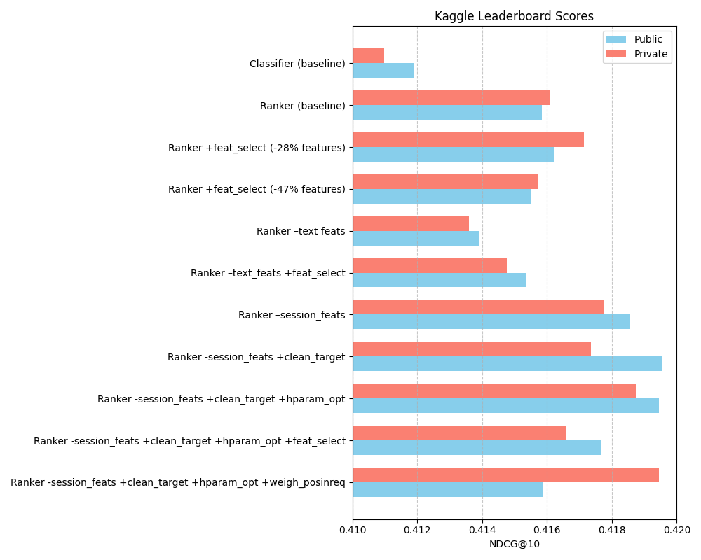

# Experiments for Recommendation System

This report summarizes the findings from a series of experiments conducted using a CatBoost-based recommendation framework. The focus is on improving model performance as measured by the Kaggle Public Score.

## Experimental Framework Advantages

The [experimental framework](https://github.com/almayor/lavka-rs-contest) offered several key advantages for rapid iteration and robust model development:

* **Modular Feature Engineering**: Features can be easily turned on or off by name, allowing for quick testing of different feature sets.
* **Replicable Configurations**: Experiments are defined by configuration files, ensuring that results are reproducible.
* **Extensible Design**: The framework is designed to be easily extended with new feature generators and model types. Other capabilities, like HParam optimization and feature selection, are built in.
* **Caches**: Features and models are cached, reducing the time of each experiment to under a minute. 

Adding a new feature:

```py
from lavka_recsys import FeatureFactory

@FeatureFactory.register('my_feature_generator', 
                         num_cols=['feature1', 'feature2'], 
                         cat_cols=['cat_feature'])
def my_feature_generator(
    history_df: pl.DataFrame,
    target_df: pl.DataFrame
) -> pl.DataFrame:
      # Add new columns using history_df
      new_feature = ...
      return new_feature
```

Then:

```py
config = (Config.load('default_config.yaml')
    .set('target', 'Weighted')
    .set('target.cleaning.enabled', False)
    .set('feature_selector.enabled', True)
    .set('model.type', 'catboost_ranker')
    .set('model.config.catboost_ranker.loss_function', 'YetiRankPairwise')
    .set('model.config.catboost_ranker.eval_metric', 'NDCG:top=10')
    .set('model.config.catboost_ranker.iterations', 500)
    .set('model.config.catboost_ranker.score_function', "Cosine")
    .set('feature_generators', [
        "time_windows",
        ...,
        #turn on a new feature generator by its name
        "my_feature_generator"
    ])
)

experiment = Experiment("catboost_ranker", config)
experiment.setup()

#results is a dict with metrics, feature importances, etc
results = experiment.run()

#create a Kaggle submission
experiment.create_submission()
```


## Baseline Performance

Two baseline models were established to provide a reference point for more complex models:

* **Random Baseline**: Achieved a Kaggle Public Score of `0.30071`. This model serves as a lower bound, representing performance with no intelligence.
* **Popularity Baseline**: This model recommends items based solely on their overall popularity (specifically, `product_total_purchases`). It achieved a Kaggle Public Score of `0.33188`.

## Model Comparison: Classifier vs. Ranker

Experiments were conducted using both CatBoostClassifier and CatBoostRanker models to determine the most effective approach for the recommendation task.

* **CatBoost Classifier**: With all features enabled (excluding session features at this stage for a cleaner comparison with one of the ranker variants later, and no specific feature selection), the classifier achieved a Kaggle Public Score of `0.41192`.
* **CatBoost Ranker**: The initial CatBoostRanker experiment, including session features and no feature selection, achieved a Kaggle Public Score of `0.41585`.

These initial results suggest that the CatBoostRanker performs better than the CatBoostClassifier for this task.

## Feature Engineering Insights

Feature engineering and selection played a crucial role in model performance.

### Overall Feature Importance

The following is a Python code snippet to generate a bar plot of the top 20 most important features based on the provided feature importance dictionary (derived from a CatBoostRanker model with session features and weighted target, before Optuna optimization):


### Impact of Text Embedding Features

Text embedding was applied to product and category descriptions using a `sentence-transformers` model `ai-forever/sbert_large_nlu_ru`. The resulting embedding was reduced using PCA to 20-dimensional vectors. These features were applied as is, or used to obtain features like `text_similarity_cluster` (product clusters based on intra-text similarity) and `text_diversity_features` (how different a product is from the mean embedding of the user's history). 

 Text embedding features (like `product_embed_` and `cat_embed_`) appear to be important:

* **CatBoost Ranker (with session features, no feature selection)** achieved a Kaggle Public Score of `0.41585` (Private Score of `0.41572`).
* **When text features were removed** (no feature selection, with session features), the Kaggle Public Score dropped to `0.41536` (Private Score to `0.41477`).

This indicates a positive contribution from text-based features. Several embedding features also appear in the top feature importances list (e.g., `product_embed_1`, `cat_embed_18`, `product_embed_12`).

### The Curious Case of Session Features

Session features (`session_duration_seconds_v2`, `session_unique_products_v2`, `session_length_v2`, `session_unique_stores_v2`) reflect actions that a user took in the last 30 minutes. They showed very high importance in the holdout set analysis (as seen in the provided feature importance dictionary, where they are the top features). However, their impact on Kaggle Public Scores was negative:

* **CatBoost Ranker (all features, including session features, no feature selection):** Kaggle Public Score = `0.41585` (Private Score = `0.41611`).
* **CatBoost Ranker (NO session features, all other features, no feature selection):** Kaggle Public Score = `0.41856` (Private Score = `0.41776`).

Removing session features led to a significant improvement in the public score. This is likely because the Kaggle test set is randomized and doesn't contain continuous logs with meaningful session context, whereas the holdout set did. This highlights a potential discrepancy between the holdout set and the public test set.

### Feature Selection Nuances

I attempted feature selection by identifying clusters of highly correlated features and picking one feature from each cluster with the highest importance. Experiments with the CatBoost Ranker (including session features and using a "Weighted" target) yielded varied results:

* **No Feature Selection:** Kaggle Public Score = `0.41585` (Private Score = `0.41611`).
* **Feature Selection (`correlation_threshold = 0.9`, `28%` features removed):** Kaggle Public Score = `0.41621` (Private Score = `0.41715`)
* **Feature Selection (`correlation_threshold = 0.8`, `47%` features removed):** Kaggle Public Score = `0.41550` (Private Score = `0.41572`).

This demonstrates that feature selection can be beneficial but needs very careful tuning; overly aggressive selection can remove useful information.

### Target Cleaning

I attempted to clean the target used for training by removing requests with <3 unique products, requests that results in only `AT_View` actions. I also removed all rows that came from `source_type = ST_Catalog`. 

* **CatBoost Ranker (No session features, No feature selection, WITH Cleaned Targets):** Kaggle Public Score = `0.41953` (Private Score = `0.41735`).

Comparing the "No session features" runs, target cleaning improved the score from `0.41856` to `0.41953` However, the Private Score decreased slightly: from `0.41776` to `0.41735`.

### Hyperparameter Optimization with Optuna

Optuna was used to optimize hyperparameters for the CatBoost Ranker. The configuration for Optuna trials was based on the "CatBoost Ranker Without Session Features and Cleaned Targets" setup, as this was the best performing model before optimization.

The notebook indicates that the Optuna study found the following hyper-parameters: `lr: 0.0241, depth: 7, score_function: L2`

* **CatBoost Ranker (HParams Optimized, No session features, WITH Cleaned Targets, No Feature Selection):** Kaggle Public Score = `0.41945` (Private Score = `0.41875`).

Comparing this to the same model without Optuna (Public Score = `0.41953`, Private Score = `0.41735`), there were mixed results.

An additional experiment was run with these optimized hyperparameters AND feature selection (`correlation_threshold=0.9`):

* **CatBoost Ranker (HParams Optimized, No session features, WITH Cleaned Targets, WITH Feature Selection 0.9):** Kaggle Public Score = `0.41769` (Private Score = `0.41661`). In this case, feature selection after HPO slightly decreased the score compared to HPO alone.

### Weighting target by `1/log2(pos_in_request + 1)`

* **CatBoost Ranker (No session features, No feature selection, WITH Cleaned Targets):** Kaggle Public Score = `0.41953` (Private Score = `0.41735`).

* **CatBoost Ranker (No session features, No feature selection, WITH Cleaned Targets, WITH Target Weighing):** Kaggle Public Score = `0.41589` (Private Score = `0.41945`).

So we see a big boost to the private score, but a significant decrease in the public score. This is probably because of the difference between public and private test sets (see the comment from the contest's author at the end).

## Conclusion and Best Performing Model

The experiments highlight several key findings:

* The developed **framework facilitates rapid experimentation** and iteration.
* **CatBoostRanker consistently outperformed CatBoostClassifier.**
* **Text embedding features are valuable.**
* **Session features, despite high local importance, negatively impacted Kaggle scores**, likely due to the nature of the test set. Removing them proved beneficial.
* **Target cleaning provided a noticeable improvement** in public scores (but little difference to private scores).
* **Feature selection offers marginal gains and requires careful tuning;** a threshold of 0.9 was slightly better than no selection or a more aggressive 0.8.
* **Hyperparameter optimization with Optuna showed strong local improvements (nDCG)** and a boost to the Kaggle Private Score. However, the best Optuna-derived parameters led to a very slight decrease on the Kaggle Public Score compared to the best non-Optuna setup in one instance, but an improvement in another.

The best performing model on the Kaggle Public Leaderboard was the **CatBoost Ranker without session features and with cleaned targets, achieving a Public Score of `0.41953` (Private Score of `0.41735`)**. The HParam-optimized version without session features and with cleaned targets, was very close at `0.41945` (Private Score of `0.41875`).



------

Comment from the context author:
> Да, в фичах сеанса реально известный даталик, мы не стали снова ниче менять, чтобы контест совсем не сгубить. Если посмотреть, там таргетные объекты 2 раза встречаются в тесте внутри каждого `request_id`.